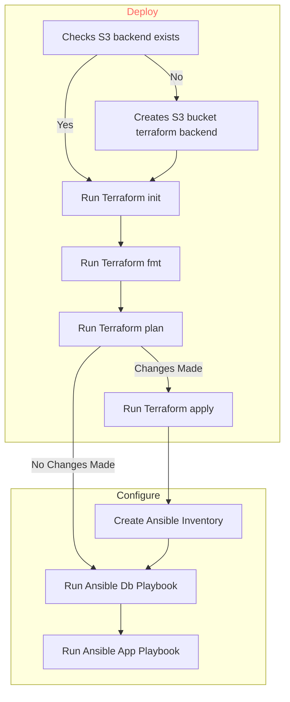

# COSC2759 Assignment 2

## Student details

- Full Name: **FILL IN**
- Student ID: **FILL IN**

## CD Pipeline Diagram

```mermaid
flowchart TB
    subgraph deploy["Deploy"]
        
        A -- Yes --> B
        A -- No --> C
        C --> B
        B --> D
        D --> E    
        E -- Changes Made --> G
    end
    subgraph configure["Configure"]
        G --> H
        E -- No Changes Made --> F
        H --> F
        F --> I
    end
    A[Checks S3 backend exists]
    B[Run Terraform init]
    C[Creates S3 bucket terraform backend]
    D[Run Terraform fmt]
    E[Run Terraform plan]
    F[Run Ansible Db Playbook]
    G[Run Terraform apply]
    H[Create Ansible Inventory]
    I[Run Ansible App Playbook]
    style deploy color:#f66

```
Remember to use headings and sub-headings as appropriate.

Good luck! :-)
