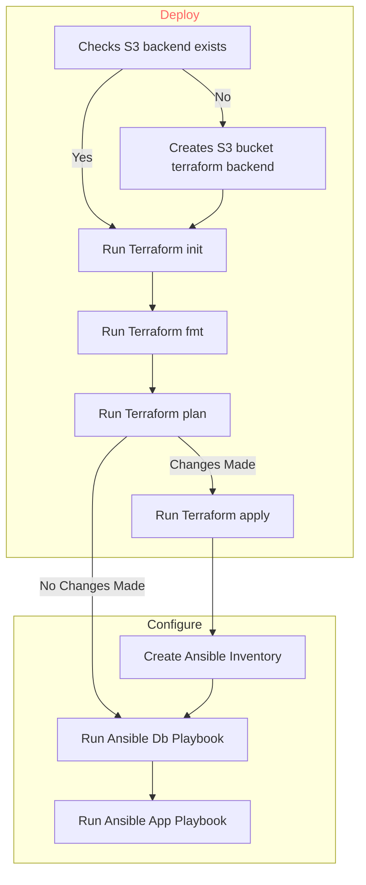

# COSC2759 Assignment 2

## Student details

- Full Name: **Luke Macdonald** 
- Student ID: **s3888490**

## CD Pipeline Diagram

## Deploying Infrastructure (Terraform)

### Backend S3 Bucket
The state file for the AWS resources created by terraform is stored in a S3 bucket. Before any terraform commands are run.
-	The pipeline script (GitHub actions or shell script) will first check that the bucket that the state is stored in exists and if it does not already exist then a terraform apply is used to deploy the S3 bucket used to store the state file.
-	An  S3 bucket is used to store the state file of the resources as permissions to access the bucket can be restricted, thereby increasing the security of the infrastructure as no unauthorised modifications/access can be made
     Architecture Diagram of Infrastructure

### Virtual Private Cloud:
The VPC deployed by terraform is created in the us-east-1 region.
-	An internet gateway is deployed along with the VPC to allow public subnets access to the internet.

### Application Load Balancer
An application load balancer (ALB) is used to balance the network traffic (listens on port 80) for an application across multiple instances.
-	This ALB maps the application traffic two either one of two of the available application instances both of which are created on separate subnets which have separate CIDR blocks in different availability zones.
-	Having the two application instances running in different subnets on different availability zone increases the fault tolerance of the application. For example if one availability zone is down, then traffic can be redirected to the other application instance running in a different availability zone.
### Security Groups:
There are two different security groups deployed by terraform.
-	The first security group is attached to all the ec2 instances and this security groups have an inbound rule for SSH (port 20), HTTP (port 80) and Postgres (port 5432) and outbound rules for HTTP, HTTPS (port 443) and Postgres. As traffic needs to be transferred between the application instances and database instances, traffic needs to be allowed for port 5432, this will allow for data from the postgres database running on database instance to transfer data to the application instance.
-	The second security group is attached to the application load balancer. Because the ALB does not need to allow traffic for the postgres port, the inbound rules for this security group includes for SSH and HTTP and the outbound rules are for HTTP and HTTPS
### EC2 Instances
A total of three EC2 instances are deployed using terraform.
-	Two instances are for running the application docker container (these are named, app1-s3888490 and app2-s3888490)
-	The other instance is for running the database (postgres) container (this instance is named db-s3888490)

The keypair used for all these instances is deployed using a public key that is stored in an S3 bucket.
-	The public key is stored in an S3 bucket to ensure that no unauthorised modifications can be made to the public key.

## Configuring Infrastructure (Ansible)
### Inventory file:
An issue faced when trying to create the ansible playbooks was how to dynamically store the public IP addresses used by the EC2 instances deployed by Terraform.
-	The solution to this issue involved creating a dynamic inventory file, where either GitHub actions or a shell script is used to create a new inventory file each time terraform apply is run. Stored within the inventory file are the public IP addresses of all the EC2 instances which were outputs for the terraform apply command.

The inventory file creates two groups.
1.	db_servers (contains a single host which is the db EC2 instance deployed by terraform)
2.	app_servers (containers two hosts which are the app EC2 instances deployed by terraform)

Each host in the inventory file contains '-o StrictHostKeyChecking=no' for the ‘ansible_ssh_common_args’ variable.
-	This is used to allow hosts to automatically be added to the VM the playbook is running on without the need for user input.

### DB Playbook:
The host for this playbook is found from the db_servers in the inventory file created.
-	The first thing is playbook will do is install all dependencies/packages that are required for this database instance to be configured correctly.
     o	This includes packages and other configurations that allow docker to run on the host machine.
-	An issue faced when trying to diagnose why docker was not running the container correctly was that the ansible user did not have permissions to access docker. Therefore after installing all the dependences into the host machine, the ansible user was added to a docker group to give permissions to run docker commands (for example docker ps)
-	Next the playbook checks that the directory that the database init script is going to be stored in exists.
     o	If it does not exist than the directory is created.
-	After ensuring that the directory exists than the Postgres init script is copied from the host machine to the db machine.
-	After copying the init script for the database, the docker container for postgres is than created and run on the db machine on port 5342.
     o	The container's port 5342 is being published on the host machine's IP address 0.0.0.0 (which means all available network interfaces) on port 5432 therefore any traffic directed to port 5342 on the host machine will be forwarded to port 5342 of the container.
     o	The init script stored on the db machine is also transferred to the container, which will initialise all the data onto the database.
### App Playbook

This playbook is run after the db-playbook and is run on all the app_servers hosts found in the inventory file.
-	Exactly like the db-playbook the first thing is playbook will do is install all dependencies/packages that are required for this application instances to be configured correctly.
-	The ansible user is also added to the docker group for the same reasons as stated for the db-playbook.
-	The docker container for the application to be run is then created and configured to be run on port 3001
-	The container's port 3001 is being published on the host machine's IP address 0.0.0.0 on port 80 therefore any traffic directed to port 80 on the host machine will be forwarded to port 3001 of the container.

## Shell Script

## GitHub Actions Pipeline